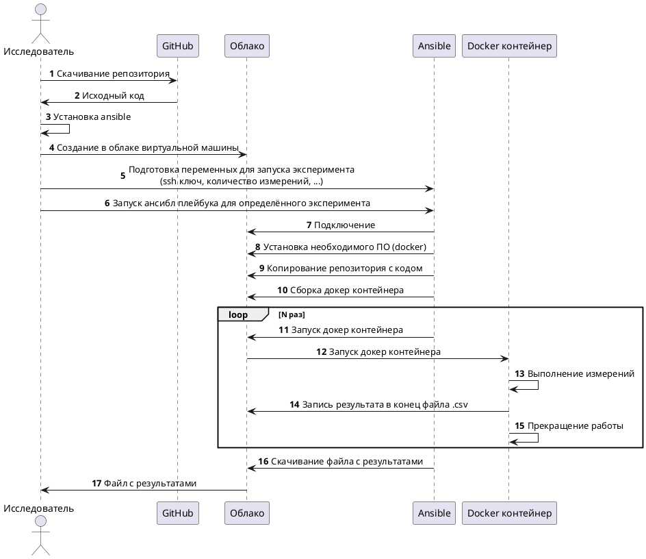

# Диаграмма проведения эксперимента

```plantuml
@startuml
autonumber
skinparam DefaultTextAlignment center

actor "Исследователь" as researcher
participant "GitHub" as github
participant "Облако" as cloud
participant "Ansible" as ansible
participant "Docker контейнер" as docker

researcher -> github: Скачивание репозитория
github -> researcher: Исходный код
researcher -> researcher: Установка ansible
researcher -> cloud: Создание в облаке виртуальной машины
researcher -> ansible: Подготовка переменных для запуска эксперимента\n(ssh ключ, количество измерений, ...)
researcher -> ansible: Запуск ансибл плейбука для определённого эксперимента
ansible -> cloud: Подключение
ansible -> cloud: Установка необходимого ПО (docker)
ansible -> cloud: Копирование репозитория с кодом
ansible -> cloud: Сборка докер контейнера
loop N раз
    ansible -> cloud: Запуск докер контейнера
    cloud -> docker: Запуск докер контейнера
    docker -> docker: Выполнение измерений
    docker -> cloud: Запись результата в конец файла .csv
    docker -> docker: Прекращение работы
end
ansible -> cloud: Скачивание файла с результатами
cloud -> researcher: Файл с результатами

@enduml
```